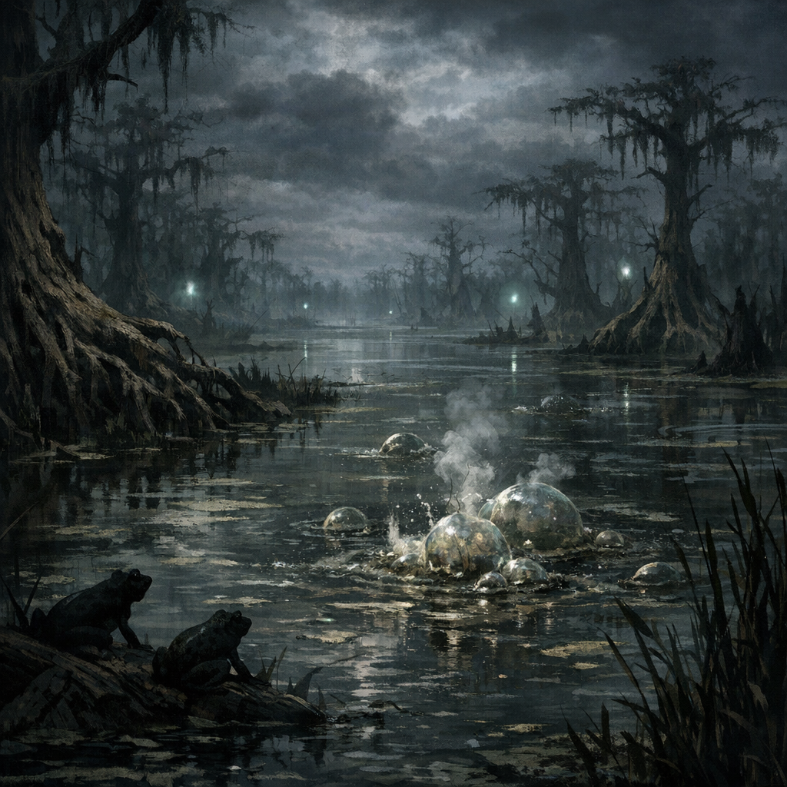

# Dellhalls Northeast Swamp

#place #swamp

## Summary

A swamp located roughly **60 miles northeast** of [[Dellhalls]] (per in-play travel notes on **2026-01-25**).

## Notable Features (confirmed in notes)

- Habitat of [[Explosive Swamp Frogs]].
- The local lake (unnamed) once hosted a **[[Green Dragon (Swamp Lake)]]** until it was slain by a **[[Gold Dragon (Westward Slayer)]]** (per frog-gossip via Robin, 2026-01-25).
- After Cromash detonated a cluster of frogs (2026-01-25), the swamp abruptly shifted from “traditional swamp sounds” to **dead silence**. (Cause unknown.)

## Hazards / Tactics

- Treat local frogs as potential **living mines** until proven otherwise.

## Open Questions

- Name of the swamp (local or historical).
- What else lives here (fey, undead, hags, cults, lizardfolk, spirits)?
- Is the swamp’s gas unusually volatile (and why)?
