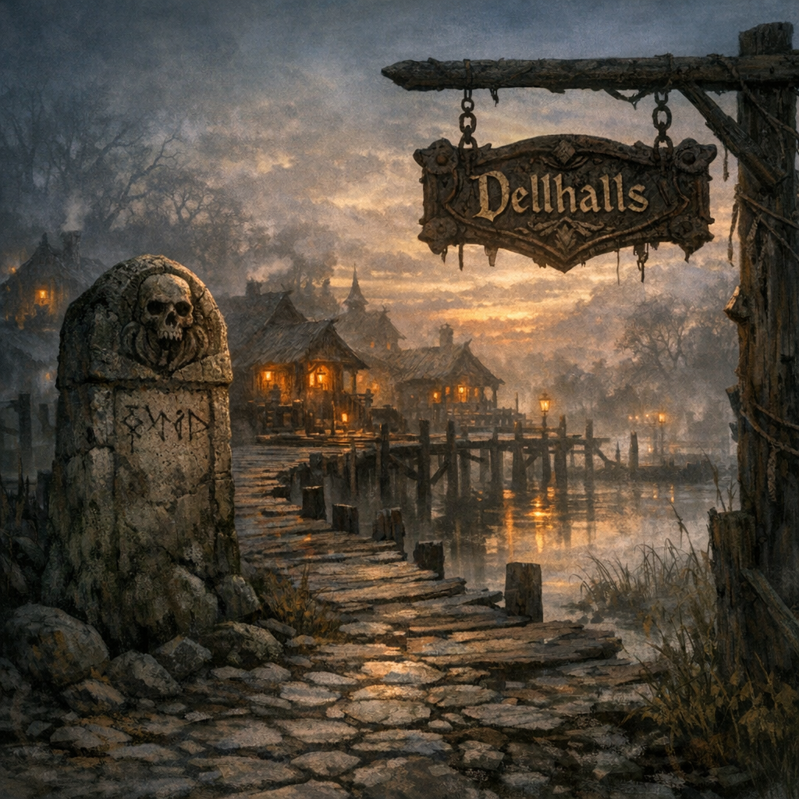

# Dellhalls

#place

## Summary

Dellhalls is the party’s **spawn point** (as remembered/claimed in-play on **2026-01-25**).

## What Voltaire Remembers / Assumes

- Dellhalls is *not* the same as Voltaire’s remembered “home swamp” kingdom directionally; traveling **northeast** from Dellhalls feels like moving *away* from his swamp.

## Open Questions

- What is Dellhalls (town, keep, crossroads, ruin, border-post, planar drop-point)?
- Who rules it, and what factions operate there?
- Why did we spawn there, and what were the immediate surroundings?
