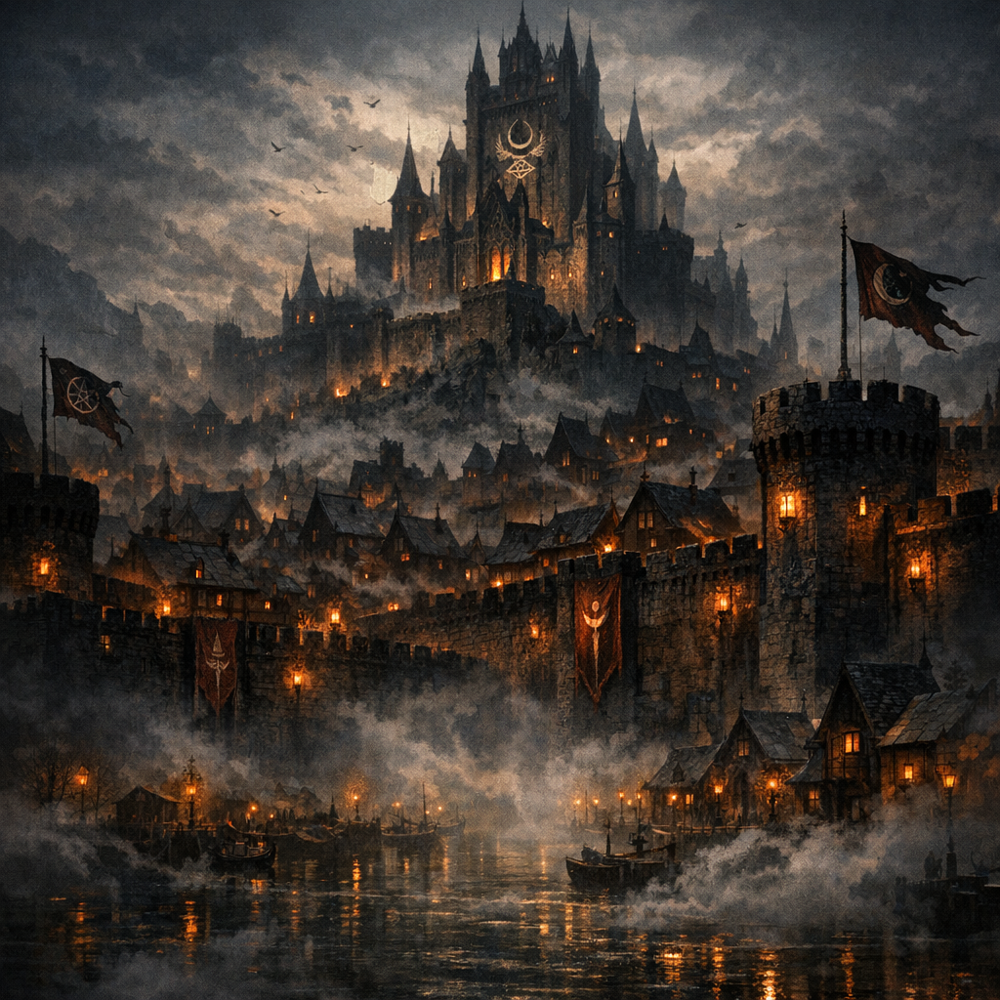

# Palashaey

#place #city

## Summary

Palashaey (also spelled “Palashae” in some notes) is a city ruled by [[Cromash]] (Lord of Palashaey).

On **2026-01-25**, the party plans to go to Palashaey for **furniture shopping** to furnish their base and set up operations.

## What the Party Knows (in-play)

- Palashaey is Cromash’s city and a place where the party can leverage his political standing and resources.
- [[Glasya]] has claimed a throne room in Palashaey after being summoned by the party.
- Palashaey has enough trade/craft infrastructure that “furniture shopping” is a plausible plan for furnishing a base and establishing operations.

## What Voltaire Thinks / Notes

- (Add Voltaire’s take: procurement as ritual, symbolism of “thrones,” contracts-in-wood, etc.)

## Key NPCs / Factions

- [[Cromash]] — Lord of Palashaey.
- [[Glasya]] — established power player; throne room claimed.
- (Local Warlock Knights — observed to react with strange nonchalance to Glasya’s presence; details TBD.)

## Open Questions

- Where is Palashaey on the map relative to current party location(s)?
- What are Palashaey’s signature industries and markets (furniture, stonework, occult trade, shipyards, etc.)?
- What is the procurement list for furnishing the [[Anauroch Triumvirate Temple — Mythallar Complex]] (beds, tables, storage, wards, lab kit, shrine goods, etc.)?
