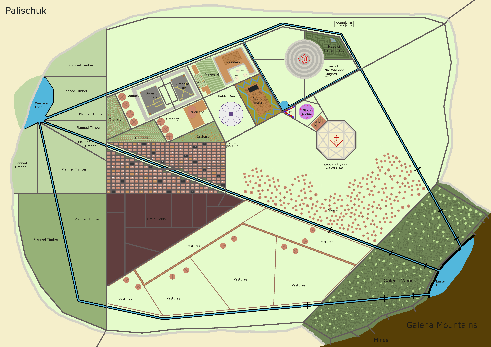
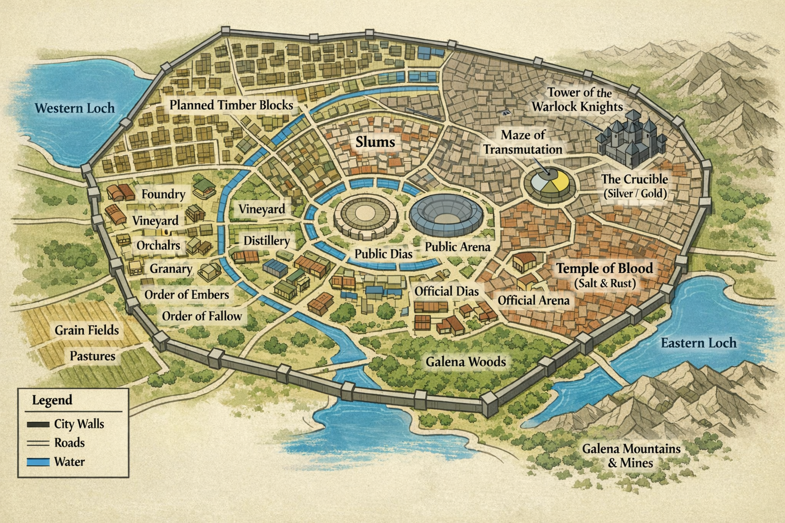

# Palashaey

#place #city

## Summary

Palashaey (also spelled “Palashae” in some notes) is the same city as [[Palischuk]] at this table. The names are used interchangeably in the notes.

Palashaey/Palischuk is ruled by [[Cromash]] (Lord of Palashaey).

On **2026-01-25**, the party plans to go to Palashaey for **furniture shopping** to furnish their base and set up operations.
On **2026-02-21**, the party is **returning to Palashaey/Palischuk** on the morning of the **4th day** after leaving it, after ending up at (and discovering) the ancient **temple** and its mythallar. (**[To verify]** exact timeline details beyond “4 days.”)

## Map (Reference + “Cool” Render)

- The original handout image is labeled **“Palischuk”**; this is consistent because **Palischuk = Palashaey** at this table.

### Original handout (as provided)

### Reference (recreated from the handout)

### Styled map (generated from the reference)

## What the Party Knows (in-play)

- Palashaey is Cromash’s city and a place where the party can leverage his political standing and resources.
- [[Glasya]] has claimed a throne room in Palashaey after being summoned by the party.
- Palashaey has enough trade/craft infrastructure that “furniture shopping” is a plausible plan for furnishing a base and establishing operations.
- **[Party] (2026-02-21)** Voltaire (disguised as [[Titania]]) entered Palashaey through the gate after a tense interaction with guards.
  - Voltaire paid **1 soul coin** (treated as **500 gp** value) and received **450 gp** back as change after asking if they accept soul coins.
  - An [[Unclaimed Slave (Palashaey)]] picked up the thrown gold and followed “Titania.”

## Demographics (Handout / To Verify)

- Demographics handout was provided for “Palashae/Palashaey,” but the source image title read **“Palischuk”**—this is consistent because **Palischuk = Palashaey** at this table.
- **Elven-blood includes**: half-elves (incl. quarter-blood), eladrin, sprites, satyrs, and drow slaves.

### Population (as recorded)

| Race | Free Child | Free Adolescent | Free Adult | Free Elderly | Slaves | Slave Child | Slave Adolescent | Slave Adult | Slave Elderly | Total |
|---|---:|---:|---:|---:|---:|---:|---:|---:|---:|---:|
| Overall | 2931 | 1178 | 8249 | 1500 | 2558 | 227 | 589 | 1720 | 22 | 16416 |
| Half-Orc | 962 | 379 | 2769 | 799 | 868 | 78 | 199 | 581 | 10 | 5777 |
| Orc | 646 | 254 | 1858 | 537 | 582 | 52 | 134 | 390 | 6 | 3877 |
| Human | 648 | 282 | 1879 | 0 | 491 | 45 | 114 | 332 | 0 | 3300 |
| Goblin | 331 | 145 | 877 | 81 | 254 | 23 | 58 | 170 | 3 | 1688 |
| Bugbear | 0 | 4 | 11 | 0 | 15 | 0 | 3 | 12 | 0 | 30 |
| Hobgoblin | 295 | 93 | 726 | 73 | 225 | 20 | 52 | 151 | 2 | 1412 |
| Dwarf | 40 | 16 | 99 | 10 | 26 | 0 | 7 | 19 | 0 | 191 |
| Tiefling | 8 | 3 | 25 | 0 | 8 | 1 | 2 | 5 | 0 | 44 |
| Elven-blood | 1 | 2 | 5 | 0 | 89 | 8 | 20 | 60 | 1 | 97 |

## Customs / Law (To Verify)

- **[Voltaire-only] (2026-02-21)** Voltaire recalls a rule of local slave custom/law: if you take charge of an unclaimed slave, you’re expected to **take care of them** (what that entails is unclear; confirm in-play).

## What Voltaire Thinks / Notes

- **[Voltaire-only]** Procurement-as-ritual: chairs are thrones-in-waiting; tables are contracts made of wood.
- **[Voltaire-only]** A city that “lets” an Archdevil squat in its throne room is either protected by paperwork… or already owned.
- **[Inferred]** If Glasya’s power is politics, then Palashaey’s markets are part of her spellcasting.

## Key NPCs / Factions

- [[Cromash]] — Lord of Palashaey.
- [[Glasya]] — established power player; throne room claimed.
- (Local [[Warlock Knights of Vaasa]] — observed to react with strange nonchalance to Glasya’s presence; details TBD.)

## Open Questions

- Where is Palashaey on the map relative to current party location(s)?
- What are Palashaey’s signature industries and markets (furniture, stonework, occult trade, shipyards, etc.)?
- What is the procurement list for furnishing the [[Anauroch Triumvirate Temple - Mythallar Complex]] (beds, tables, storage, wards, lab kit, shrine goods, etc.)?
