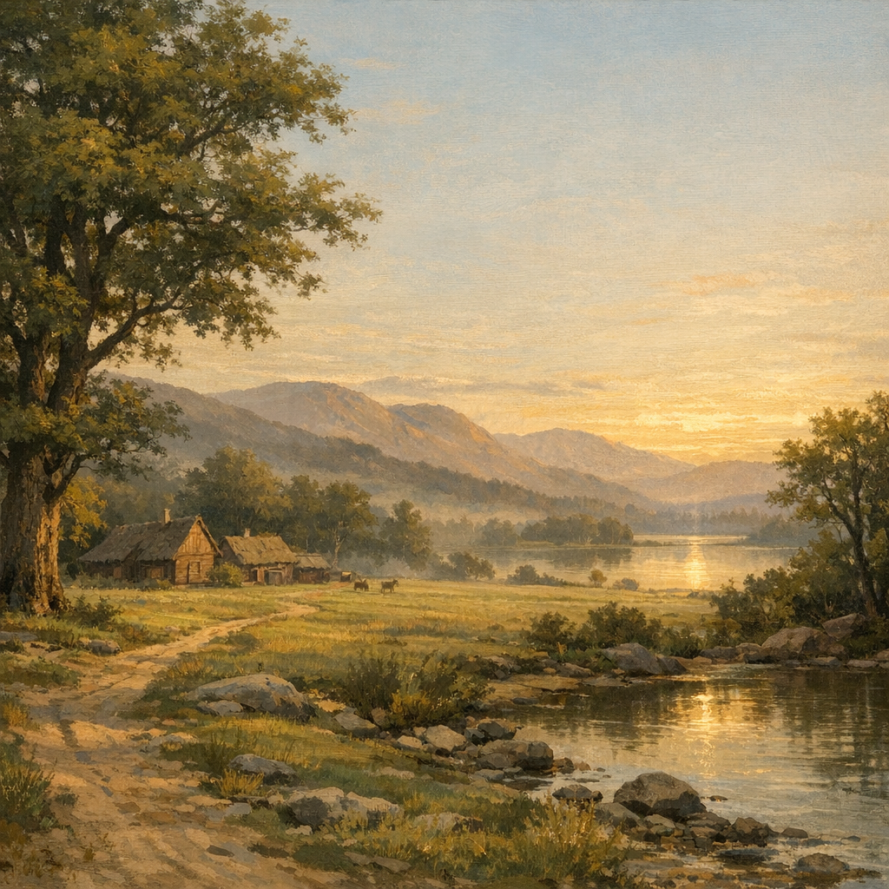

# Prime Material Plane

#place #plane

## Summary

The “default” reality of Voltaire’s current adventures: the baseline plane contrasted against Shar’s realm, the Shadowfell, and other extradimensional spaces.

## Notes

- Voltaire has described returning from Shar’s realm as “jarring” compared to the Material’s disorder (see `Adventures/2025-08-16.md`).

## Open Questions

- Which Material-world region(s) are currently relevant to the party’s arc (Anauroch, Palischuk, etc.)?
