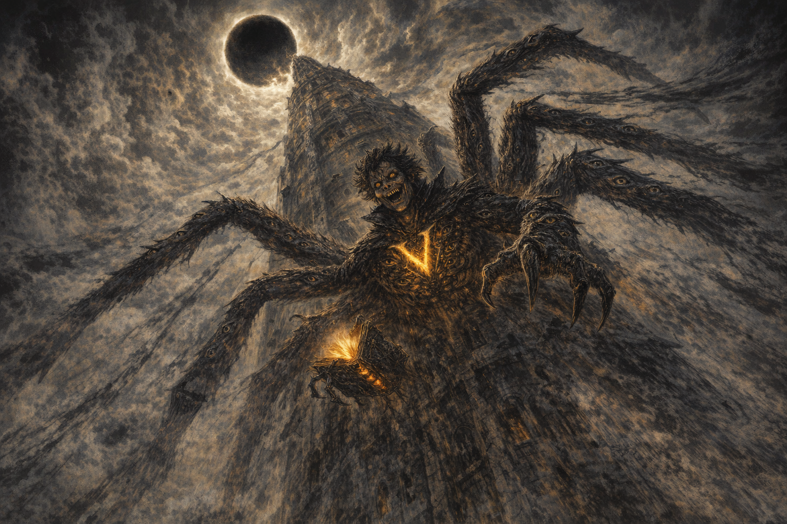

# Shadar-kai Tower of Bright Darkness

#place #feywild #shadow #tower #voltaire

## Summary

**[Voltaire-only]** An approximately 30 km-tall tower in a Shar-influenced region of the Feywild, crowned by a sphere of “bright darkness” or **anti-light**. Roughly twenty Shadar-kai inhabit or guard it and have become Voltaire’s followers/initiates.

## Known Areas

### Lower Tower / Temple

- The Shadar-kai admitted Voltaire here after their blood initiation.

### Statue Chamber

- Contains divine statues identified as [[Shar]], [[Loviatar]], and [[Mask]].
- The room can pulsate with overwhelming force; Voltaire endured or fought it for twenty-four seconds.
- Mask’s statue was hollow and crumbled during Voltaire’s ritual destruction.
- Voltaire occupied the empty statue position for six subjective months.

### Summit

- Crowned by a sphere described as “bright darkness” and later **anti-light**.
- On 2026-07-25, Voltaire assumed giant-spider form and began sprinting up the tower toward it.
- **[Voltaire-only | Declared, not yet resolved]** Voltaire intends to perform his first divine rite at the highest point: thank Shar, use his own blood to inscribe Shar’s geometry and the followers’ sigil around the anti-light, and drive V through the completed mark.
- **[Voltaire-only | Intended result]** Voltaire seeks to claim the tower as his realm—a threshold between the Feywild and Shar’s realm—and awaken teleportation between his connected sigils.

## Open Questions

- What is the tower’s true name and purpose?
- What is the anti-light sphere: beacon, aperture, prison, divine seat, or threshold?
- How do the statue chamber and summit sphere relate?
- Can Voltaire’s rite transform the tower into a new threshold realm, or will it instead alter, awaken, damage, or release whatever the anti-light contains?
- Which prior marks answer the proposed teleportation call, and who or what can pass through them?
- Does the six-month statue vigil correspond to another negligible interval outside the tower?
