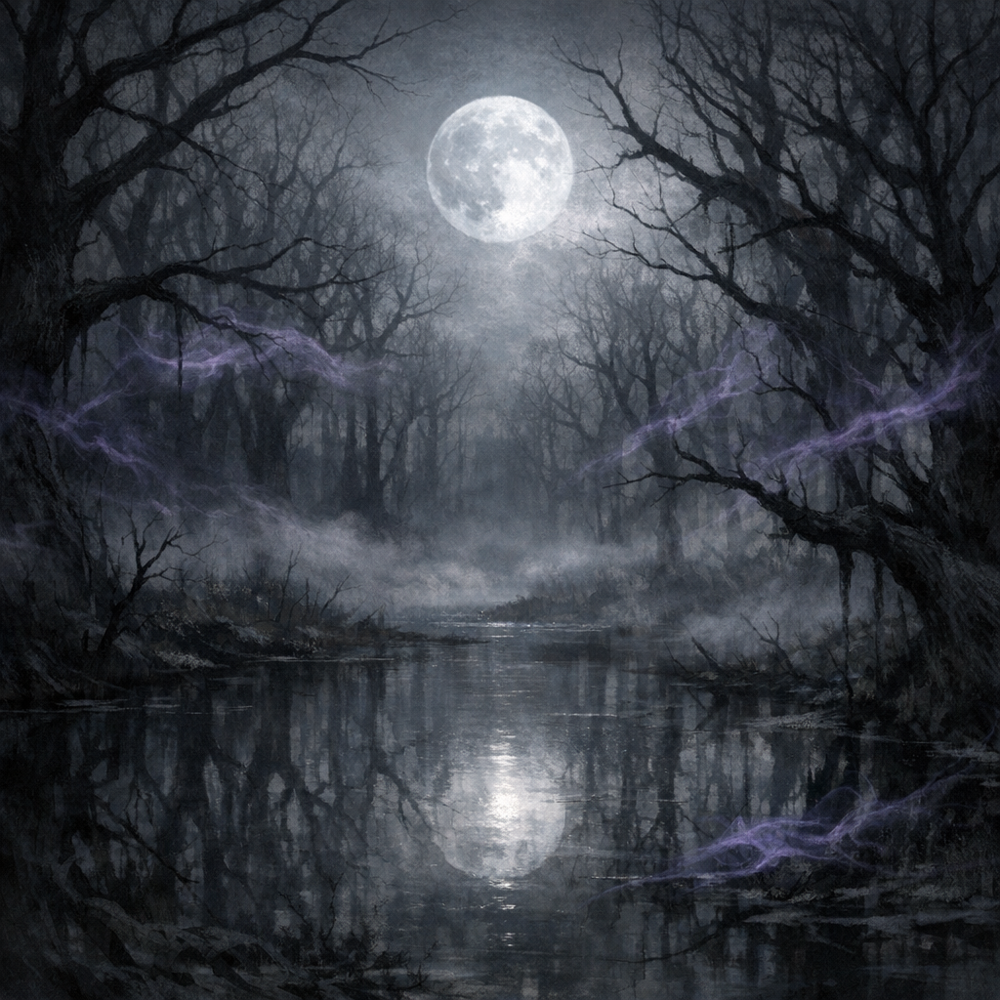

# Shadowfell

#place #plane #shadowfell

## Summary

A plane of shadow, loss, and dim reflection of the Material—strongly associated with [[Shar]]. It is reachable from the Anauroch temple via the B4 gateway and has hosted Voltaire’s proselytizing under the aspen tree.

## Known Access Points

- [[Anauroch Triumvirate Temple - Mythallar Complex|Anauroch Triumvirate Temple — Mythallar Complex]]: B4 gateway (aspen visible on the Shadowfell side).

## Open Questions

- What region of the Shadowfell does the aspen gateway open onto?
- What entities are “local” to the grove (shadow beings, lesser shades, etc.) and what do they want from Voltaire?
