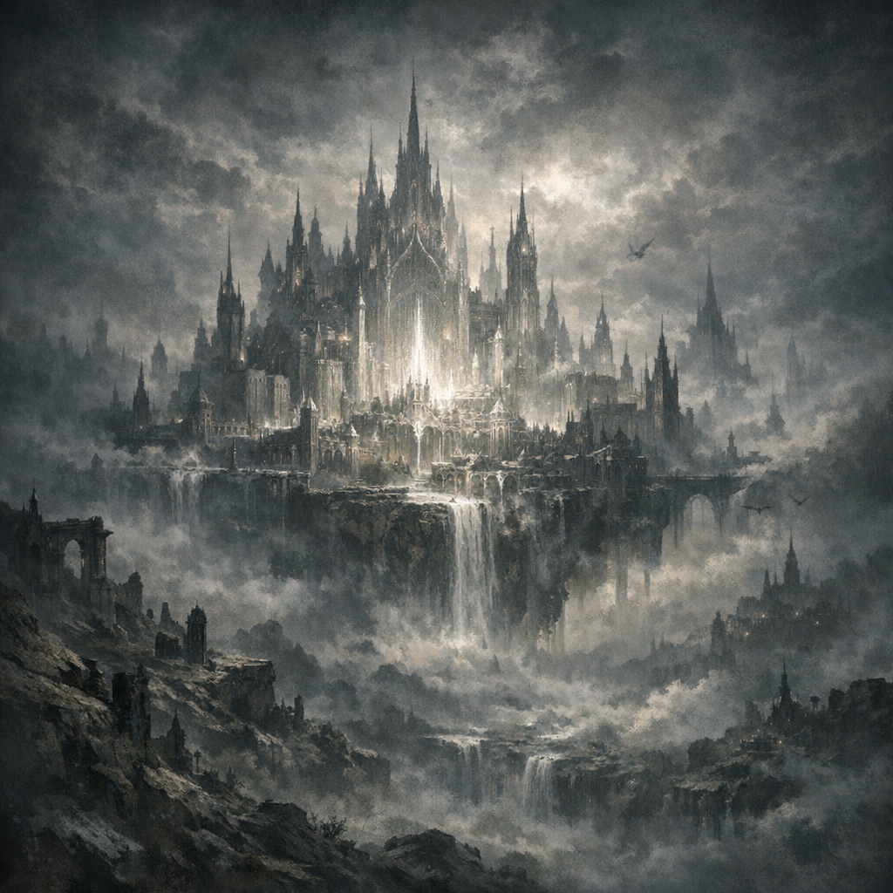

# Silver City

#place #unknown

## Summary

“The Silver City” appears in Voltaire’s paper notes alongside “Machinations” and “city of Machinations.” It may be a literal location, a plane-region, or a metaphorical chapter/construct within the crab-book’s internal cosmology.

## What the Party Knows

- Nothing confirmed in-play yet.

## What Voltaire Knows (paper notes; unconfirmed)

- Names/phrases recorded:
  - “The Silver City”
  - “Machinations, the city of Machinations”
  - **[To verify]** “Shar’s older relative … key to the Silver City” (speculative phrasing)

## Open Questions

- Is the Silver City reachable on-map (Material/Shadowfell/Nine Hells/etc.), or only via Head-Space™ / crab-book ritual work?
- Is this connected to Shar’s trial symbology (circle/square/triangle) or to Voltaire’s “Machinations” title?

