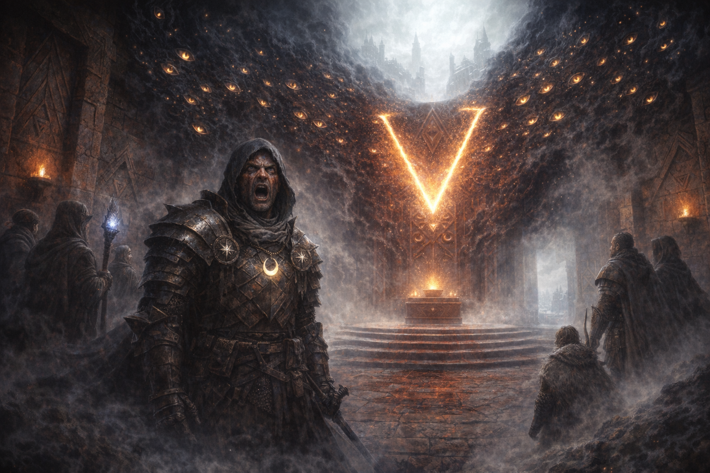

# Temple of Blood

#place #temple #shar #voltaire #palashaey #to-verify

## Summary

**[Party]** A blood-associated temple in or near [[Palashaey]] / Palischuk. Its exact formal name, location, original deity, and relationship to the map’s triangular temple motif remain **[To verify]**.

## Remote Manifestation (2026-07-25)

- **[Party]** The party was at the temple and was planning to convert it to [[Shar]].
- **[Voltaire-only]** While separated from the party and ascending the [[Shadar-kai Tower of Bright Darkness]], Voltaire suddenly perceived the scene through Cornholio/Tom’s eye “in reverse.”
- **[Party | To verify mechanism]** The notes associate Voltaire’s apparent ability to influence Cornholio/Tom with Cornholio/Tom having signed the Ink-laden visitor book at the Warlock Knights’ tower.
- **[Party]** The temple suddenly turned black and Voltaire’s voice echoed through the halls: **“Machinations.”**
- **[Party]** Numerous manifestations of Voltaire’s eyes formed around the walls and coalesced into **V**.
- **[Party]** The temple was described as **cleansed in the name of Voltaire**, and its oppressive atmosphere diminished.

## Interpretation Boundaries

- This manifestation occurred **before** Voltaire’s planned first divine rite at the summit; it is not evidence that the tower-claim or teleportation rite has already happened.
- **[Inferred]** The event demonstrates some combination of remote sight, voice, influence, symbolic manifestation, consecration, or domain pressure.
- **[To verify]** Whether the visitor-book signature created the conduit; whether Cornholio, Shar, the Blood Temple, the Robe of Eyes, Divine Rank 1, or some combination enabled it; and whether the effect is repeatable.

## Sundew Chamber Encounter

- **[Party]** After the manifestation, the party moved one room farther to investigate.
- The chamber was filled with **sundews**, which the party began burning.
- A large [[Lizard-Scorpion Beasts (Blood Temple)|lizard-scorpion beast]] emerged and attacked.
- Its scorpion-like tail dripped black ooze.
- Norhan’s character blasted the beast for **150 damage**, destroying one leg without stopping it.
- A second beast emerged while stalking toward an unclear party member and filled the chamber with an unclear pheromone effect. **[To verify]**

## Open Questions

- Who or what originally controlled the temple?
- What exactly did “cleansed” remove, suppress, or replace?
- Is the manifested V now a persistent divine mark or teleportation candidate?
- Can Voltaire perceive through Cornholio again, and can Cornholio resist or deliberately open that connection?
