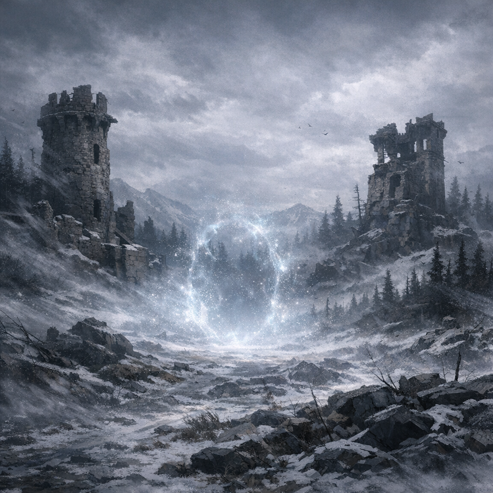

# Vasa

#place

## Summary

Vasa is the party’s chosen teleport destination (selected on **2026-01-25** instead of a location near Baldur’s Gate).

## What Voltaire Remembers / Assumes

- (To be filled as the party arrives and details become known in-play.)

## Open Questions

- Where in Vasa did the teleport land (settlement, ruin, wilderness, fort)?
- What time pressure or objective brought us here?
- What factions/forces are active here right now?
