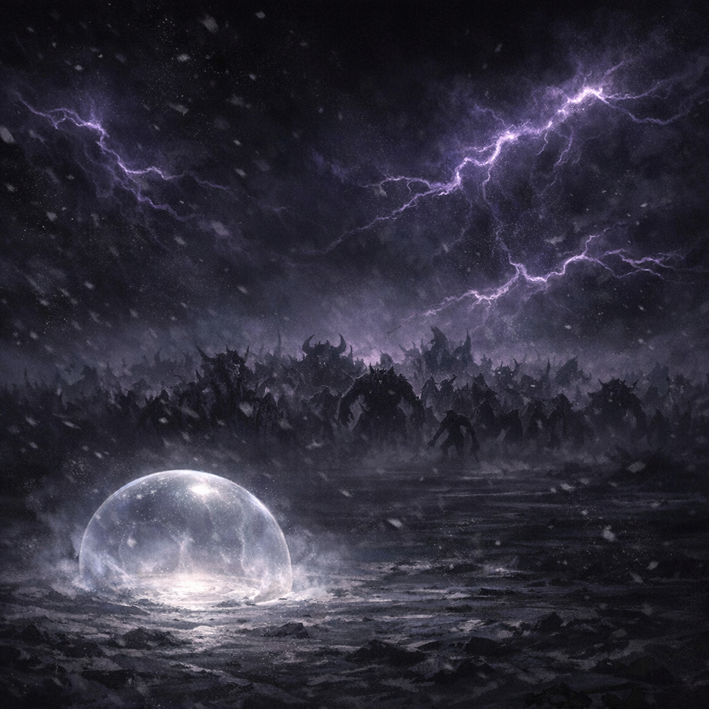

# Void Realm

#place #plane #void

## Summary

A hostile “void realm” briefly entered by Voltaire and his Sun Card disciple [[Robin]]. Within, they observed hordes of monsters gathering/approaching and retreated.

## Party Knowledge

- Voltaire reports a brief incursion and retreat after sighting hordes of monsters.

## Voltaire-Only Knowledge

- The incursion was used as a preliminary “environmental stress test” for the newly created disciple.

## Open Questions

- What plane/region is this (true void, Shadowfell-adjacent, Shar’s realm, something else)?
- What were the monsters, and what were they converging on?
