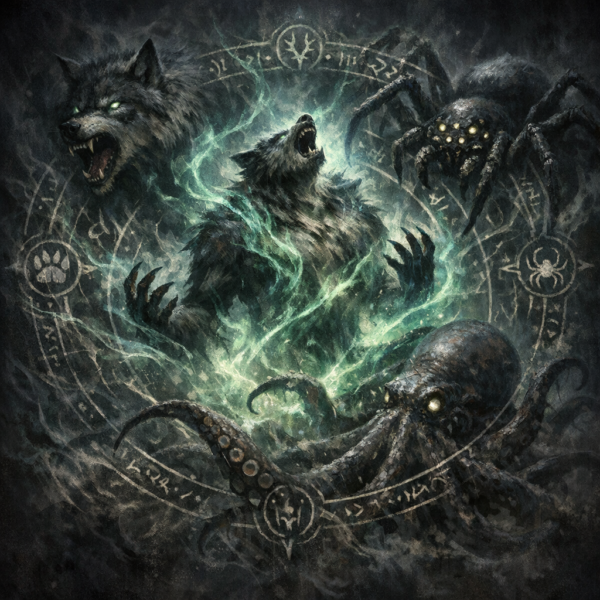

# Feral Transformation

#power #warlock #shapechange

## Summary

Feral Transformation is a feature on Voltaire’s D&D Beyond sheet that allows him to transform into a limited set of beast forms (dire wolf, giant spider, giant octopus) following polymorph-like rules.

## What Voltaire Can Do (sheet-derived)

- **Activation**: Action
- **Uses**: 1 / Long Rest
- **Duration**: 1 hour, or until the form drops to 0 HP (excess damage carries over)
- **Forms**: Dire Wolf, Giant Spider, Giant Octopus
- **Retention**: Keeps INT/WIS/CHA and all saving throw proficiencies; gains the beast’s physical capabilities and relevant skills.
- **Casting**: Can speak and can cast spells that only have a verbal component.

## Open Questions

- What is the narrative source of this feature at this table (boon, invocation variant, story reward)?
- Does the beast form visually reflect Voltaire’s tattoos/crab-book bond in any way?
