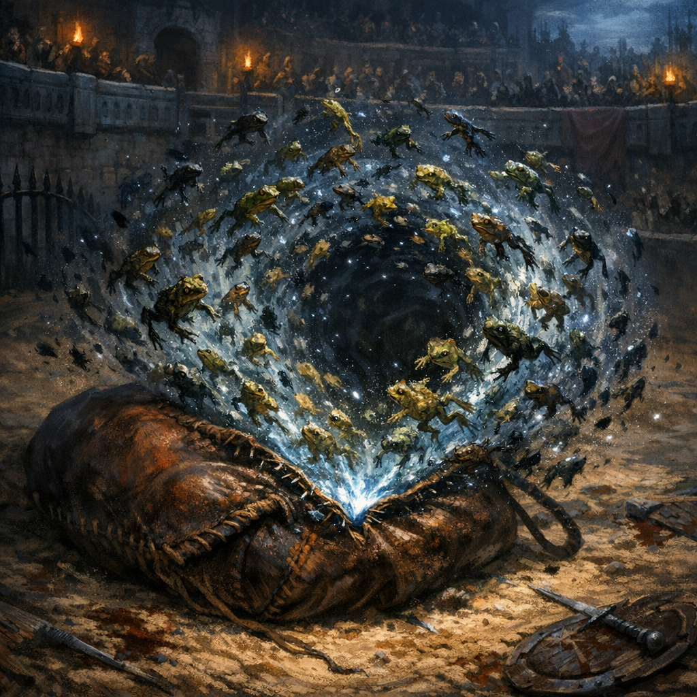

#ability #norhan #grung #scribes-folly #mindspace #to-verify

## Summary

**Frog Swarm** is a Norhan/Yadonk arena-clause ability in *Scribe’s Folly* head-space: she tears a seam in the frog-bag “swamp sky” and lets a coordinated swarm of grung/frogs spill out as a living hazard.

## Knowledge Boundaries

- **[DM-private]** This ability is written for the *Scribe’s Folly* module bout and may not exist in the main campaign.
- **[To verify]** Whether the frogs are truly “hers” or whether she is borrowing a faction (frog-court) that expects payment later.

---

## Frog Swarm (module ability)

**Use:** Once per bout.  
**Action:** Action  
**Range:** 60 ft  
**Area:** 15-ft-radius zone (swarm)  
**Duration:** 3 rounds (ends early if dismissed)  
**Save DC:** Norhan’s spell save DC (or DC 16 if you need a fixed number)

### Effect

Choose a point within range. A dense **Frog Swarm** erupts there, filling the area with slick bodies and croaking chorus.

- The zone is **difficult terrain** for enemies.
- **Swarm Sting (1/turn):** The first time each turn that a creature **enters** the zone or **starts its turn** there, it makes a **Constitution save**.
  - **Fail:** 2d6 poison damage and **poisoned** until the end of its turn (while poisoned this way, it **can’t take reactions**).
  - **Success:** Half damage, no poisoned.

### Command (bonus action)

On each of Norhan’s turns, she can use a **bonus action** to move the swarm up to **15 ft** to an unoccupied space (it flows around obstacles like water).

### Fuel (optional)

If you want the frog-bag economy to matter:

- When Norhan uses Frog Swarm, she must “spend” **10 frogs** from the frog-bag (stage-prop accounting).
- If she can’t/won’t, the swarm still manifests but costs **1 Favor** as the crowd “pays the wranglers.”

### Crowd beat (optional)

The first time each round Frog Swarm poisons someone, Norhan gains **+1 Favor** (the audience loves slapstick suffering).

