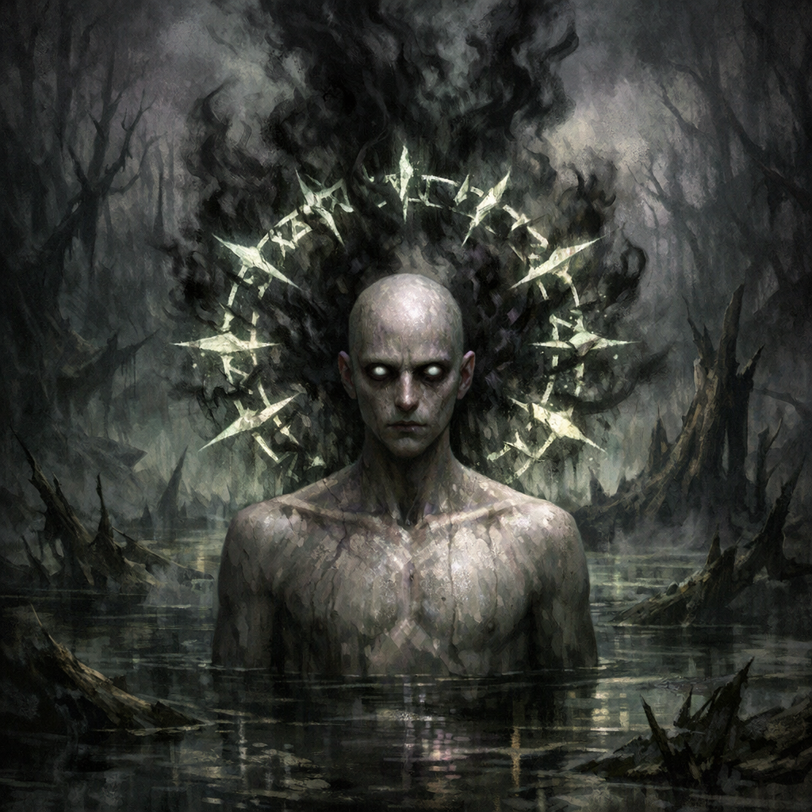

# Gnosis (State)

#power #psychology #quirk

## Summary

“Gnosis” is a named internal state recorded on Voltaire’s paper character sheet, tied to a specific aggression trigger.

## Voltaire-Only Knowledge (paper sheet)

- Quote: “Anyone that stops me from being ‘Gnosis’, I respond with malaligned aggression.”
  - **[To verify]** Whether “malaligned” is literal (alignment-shift) or just descriptive phrasing.

## Interpretation (inferred; to verify)

- Voltaire experiences interruption/constraint as a direct threat to selfhood, producing immediate hostility.
- This may be a roleplay handle for the character flaw captured elsewhere on the sheet.

## Open Questions

- Is “Gnosis” a magical compulsion/curse, or just Voltaire’s chosen term for a mindset?
- Does it have any mechanical impact (conditions, saves, etc.)?
