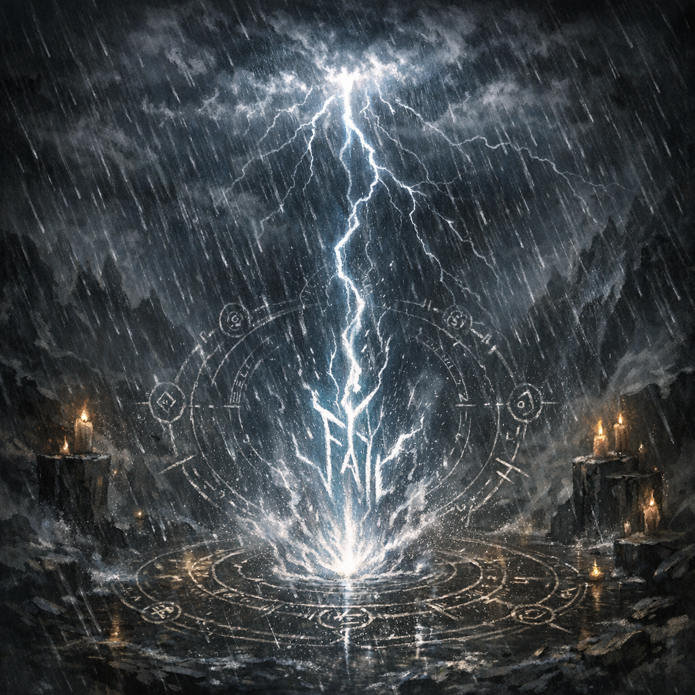

# Word of Power - “Fall”

#power #word-of-power #storm

## Summary

Voltaire recorded a “word of power” written as **Fall**, which (in at least one instance) summoned a torrential storm.

## Voltaire-Only Knowledge (paper sheet)

- “Added to crab book, with writings of ‘fall’ word of power.”
- “Imbued the black maiden’s lips and wrote a word of power on the ground ‘Fall’ which summoned a torrential storm.”

## In-Play Use (chronicle fragment)

- In a crisis at the Tiamat shrine (with [[Glasya]] attempting to close a tear in reality), Voltaire drew an outer circle using hellhound ink and sealed it with **Fall** to reinforce containment (**[To verify]** whether the effect was storm-summoning, warding, forced descent, or a table-specific hybrid).

## Open Questions

- Is this tied to [[The Ink of Unbeing]], the [[Crab Book]], or a separate spell/ritual?
- Is “black maiden” referring to [[Shar]] (title association), another figure, or an object?
- Is “Fall” reusable, or was it a one-time event?
