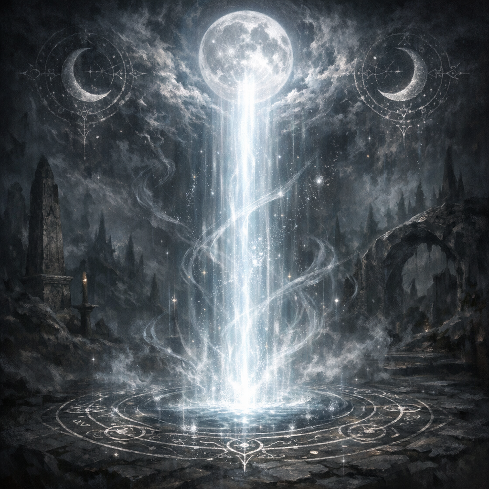

# Moonbeam

#power #spell

## Summary

A spell referenced in Voltaire’s paper notes as a movement/action cue (“go into moonbeam”). Context is unclear.

## Evidence (notes)

- Mentioned in [[IMG_2619 (undated)]]: “go into [[moonbeam]]”.

## Open Questions

- Was this a reminder for an ally, or a plan to step into an existing Moonbeam effect?
- Is “moonbeam” here literal spellcasting, a codename, or a metaphor for lunar exposure (see [[Lunar Silver]])?

