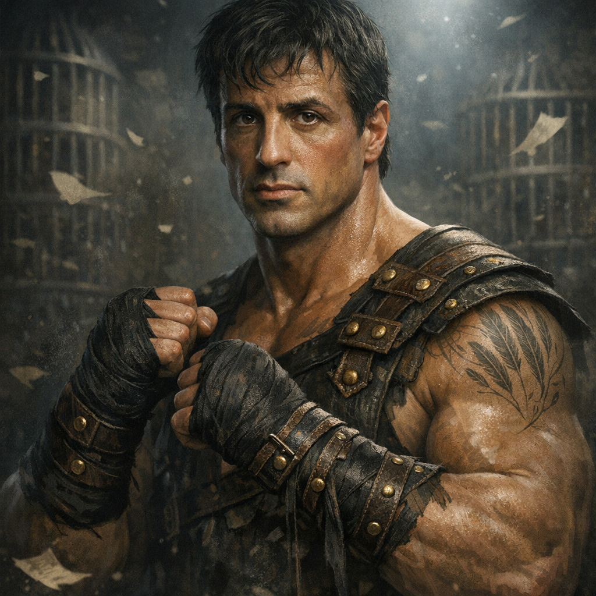

# Balboa (“Rocky”) — Prose Pugilist

#character #npc #gladiator #ludus #head-space

## Summary

Balboa is a crowd-built prizefighter (a “stage-prop person”) who manifests when someone performs the **Rocky Balboa** bit hard enough in the Ludus. He’s equal parts coach and bruiser: he wants drama, clean nonlethal knockdowns, and a clear “rival”.

Use him as:
- A **friendly cage-neighbor** / hype-man.
- A **temporary allied NPC** in a bout (especially if you need an extra body in a lopsided team).

## Table Roleplay

- Speaks in short fight-maxims: “Breathe.” “Hands up.” “Make it a scene.”
- Treats the crowd like a god you can bargain with.
- If Voltaire heckles, Balboa nods like it’s normal weather.

---

## Stat Block (5e, bounded “module NPC”)

*Medium humanoid (stage-prop), unaligned*

**Armor Class** 17 (wrap-guard)  
**Hit Points** 105 (14d8 + 42)  
**Speed** 30 ft.

STR 18 (+4) DEX 16 (+3) CON 16 (+3) INT 10 (+0) WIS 14 (+2) CHA 16 (+3)

**Saving Throws** Str +8, Con +7, Wis +6  
**Skills** Athletics +8, Insight +6, Intimidation +7, Performance +7  
**Damage Resistances** psychic (optional)  
**Senses** passive Perception 16  
**Languages** Common, Arena Cant  

### Traits

**Nonlethal Instinct.** Balboa always deals nonlethal damage unless the table explicitly opts into lethal consequences.

**Crowd Favorite (1/round).** The first time each round Balboa:
- reduces a creature to 0 HP (nonlethal), **or**
- takes damage and is still standing at the end of the turn,  
the crowd roars. Gain **+1 Favor** (cap still 6).

**Corner Coach (1/bout).** As a bonus action, choose one ally Balboa can see within 30 ft. That ally gains **10 temporary hit points** and **advantage on their next attack roll** before the end of their next turn.

**Second Wind (1/bout).** As a bonus action, Balboa regains **20 HP**.

---

## Actions

**Multiattack.** Balboa makes **three** Ink-Wrapped Fist attacks.

**Ink-Wrapped Fist.** *Melee Weapon Attack:* +8 to hit, reach 5 ft., one target. *Hit:* 1d8 + 4 bludgeoning damage plus 1d6 psychic damage.  
If Balboa hits the same target with **two** fists in the same turn, the target must succeed on a **DC 15 Constitution** saving throw or can’t take **reactions** until the start of its next turn (their “line gets broken”).

**Clinch & Drag (Recharge 5–6).** *Melee Weapon Attack:* +8 to hit, reach 5 ft., one target. *Hit:* 1d6 + 4 bludgeoning damage, and the target is **grappled** (escape DC 15). Until the grapple ends, Balboa can move the target with him (speed halved), and the crowd’s spotlights “follow”.

**Montage Shout (1/bout).** Balboa picks up to **two** creatures he can see within 30 ft. Each may immediately:
- stand up from prone (if prone),
- and move up to **10 ft** without provoking opportunity attacks.  
If at least one of them uses the movement to enter a spotlight tile or close to a declared rival, gain **+1 Favor**.

---

## Reactions

**Slip the Clause (1/round).** When Balboa is hit by an attack he can see, he reduces the damage by **1d10 + 4** and can move **5 ft** (no opportunity attacks).

---

## Scaling (fast)

- If the PCs are **stronger than expected**: +20 HP and Balboa’s fist attacks become **+9 to hit**.
- If the PCs are **weaker than expected**: -20 HP and Balboa’s Multiattack becomes **two** fists.

---

## Notes for this session

- If Tom wants “Team C: Rocky Balboa” to be real: let Balboa count as a **drafted ally** for 1 bout, paid in **Favor** or a Key-Tag.
- If you want Balboa to push Stu↔Zeppo conflict: Balboa declares “two fighters, one spotlight,” and the crowd spends **2 Favor** for the Grudge Spotlight.

