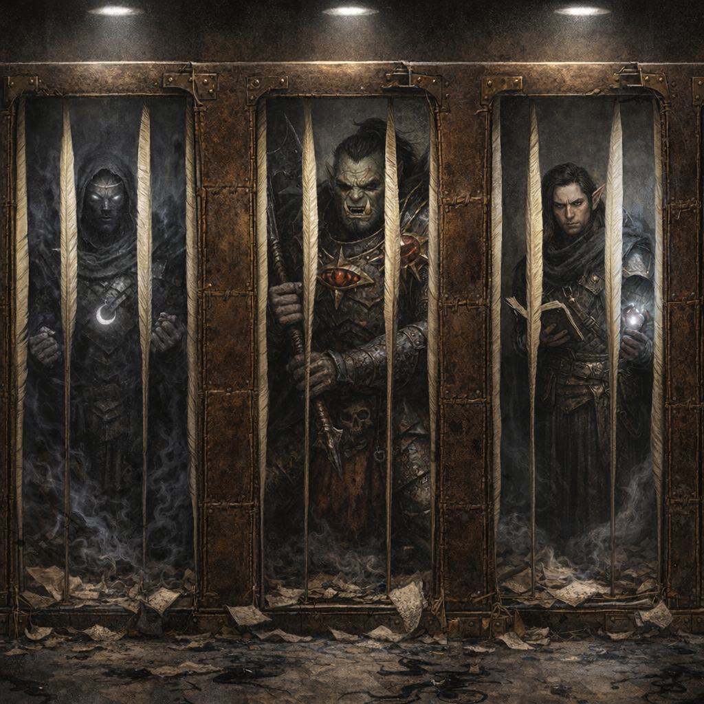
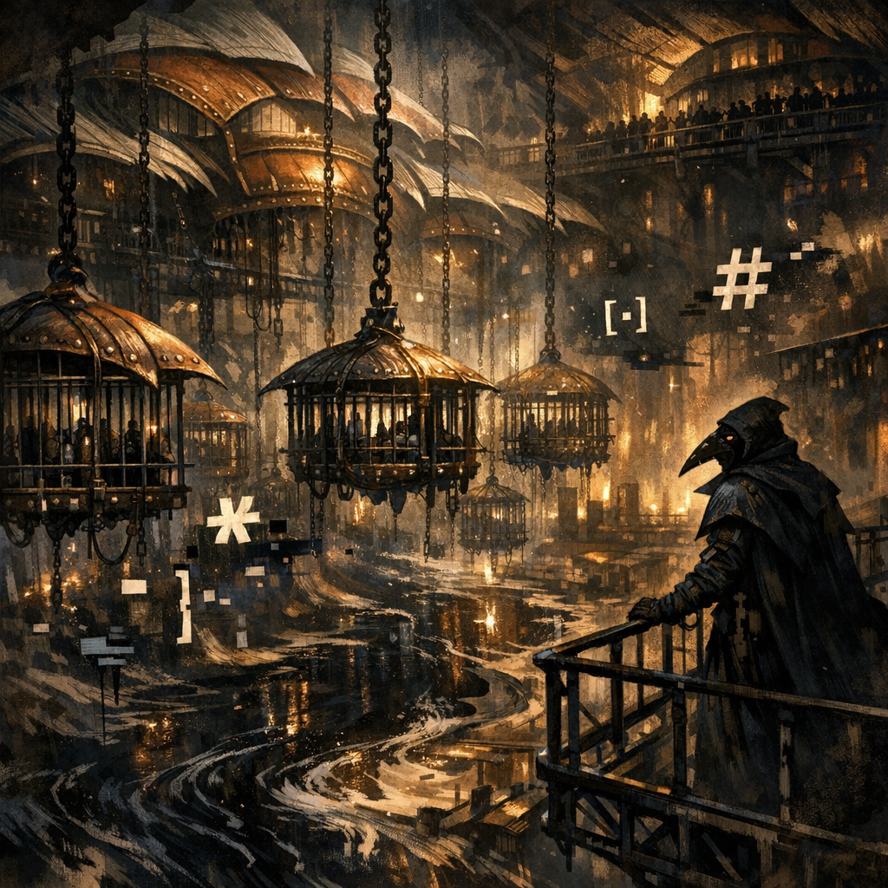
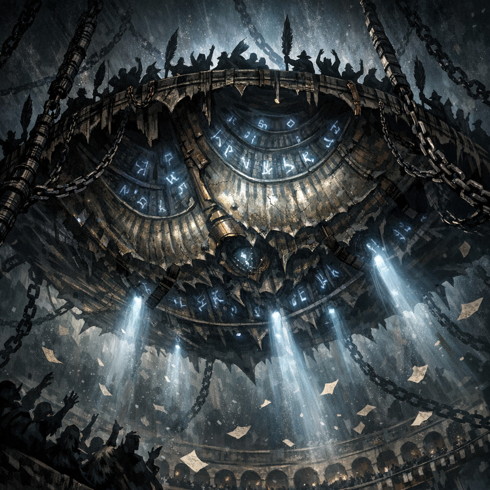
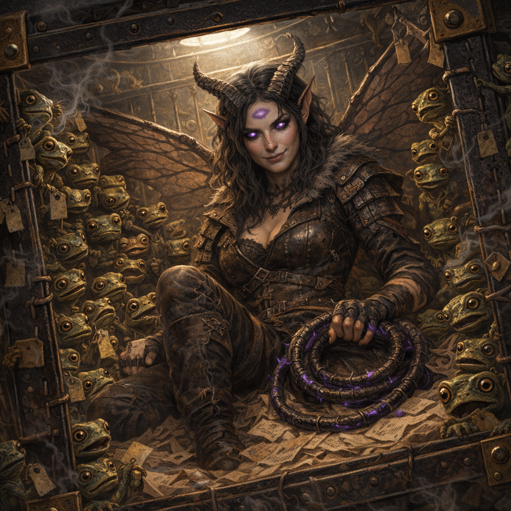

# Scene 1 (Cage of Commentary) — DM Notes

**Date:** 2026-02-28  
**DM:** Maitland  
**Players present:** Tom, Norhan, Stu, Tina, Matthew  

**Continuing from:** `Module/Scribes-Folly/Scene 0/DM notes.txt`  
**Primary module reference:** `Module/Scribes-Folly/01 - The Scribe's Folly.md` → **Scene 1 — The Cage of Commentary (Ludus of Margins)**

---

## Scene 1 visuals

---

## Quick recap into Scene 1 (from Scene 0)

- Smash-cut capture ends Scene 0; everyone wakes in the **ludus jail/cages** (Spartacus vibe).
- If needed, re-say the “bookmark” detail: thumb glyphs (circle/square/triangle) appear as fresh faint tattoos.

---

## Scene 1 goals (planned)

- Establish: cage is **bookbinding** (leather straps, brass corners, stitched seams; bars are quills).
- State stakes plainly: locked gates, arena above, escape is possible, **rules are unfair**.
- Set up economy: **Key-Tags = keys + currency** (1 tag opens 1 locker; excess tags later buy Vault rewards).
- Let them breathe: cage RP + paranoia + rivals + sponsor whispers.
- Give choices: **2 Ludus actions** before Bout 1 (ally / scout / train / sabotage / perform).
- Seed Gate puzzle pressure: circle/square/triangle insets; clues can drip from Raven / rivals / “Margin Note”.

---

## Tonight’s beat sheet (your desired beats)

1) **Make them spend** (tokens/points, Key-Tags, Favor) on tangible things.  
2) **Then reveal** they can also spend **tokens/points or Favor** to influence **who is on whose team** for the next gladiatorial bout.  
3) Define what **Tina’s Selûne recruit** and the **Unnamed Gladiator** can do (fast, table-usable).  
4) Team formation: everyone rolls; **closest rolls get grouped together** (then let spending bend it).  
5) Pay off **Stu ↔ Zeppo rivalry**: Zeppo appears in the cage beside Stu with the “Zeppo-sent” **quasit** vibe; imply Zeppo truly did it.  
6) Give them a deliberate “talk it out” window (alliances, threats, bribes, swaps).  
7) The cages **rumble** and rise into the arena; their bout opponents are **each other** (in their new groups).  
8) **FIGHT.**  
9) Make **Favor** feel like an audience with leverage; give a clear way for **Zeppo and Stu** to end up trading blows.  
10) Ensure **spent points/items matter** in this PvP bout; decide **rewards**.

---

## Personalized cold open: Norhan’s cage (grung swarm)

Use this as the first “we’re still in continuity” punch-in for Norhan’s PC (called **Yadonk** in the last-session frog rumor; otherwise use the PC’s name at the table).

- Norhan wakes first: her cell is **already occupied** by **dozens of grung** (tiny frog-people) clinging to quill-bars and stitched seams like an audience in miniature.
- They’re *too quiet* at first—then, all at once, they begin to **croak in rhythm** like chanting spectators.
- The Quillmaster (dryly): “Oh good. Your *fan club* made it.”

**What the grung do (pick 1–2):**
- **Offer a trade:** “Shiny tag for shiny story.” If Norhan gives up 1 point *or* 1 Favor *or* a minor item, the grung pass her **1 Loose Key-Tag** through the bars.
- **Poison-pressure:** touching the grung gives a mild poison sting (Con save DC 12 or disadvantage on the next check/attack this scene) to discourage casual shooing.
- **Frog-court hint:** they whisper a Gate clue in broken chorus (circle/square/triangle) *but only after* Norhan “entertains” them (Performance/Intimidation DC 14 → +1 Favor if it lands).

**Purpose:** ties Norhan’s ongoing “frog thread” into the module’s economy (spend now, get leverage now).

---

## Dials / rulings (pick now)

### Gear approach (choose one)

- [ ] **A: Signature item** — each PC keeps 1 signature item; the rest is in lockers.
- [ ] **B: Arena loadout** — simple gear baseline; first Favor spend can “drop” better gear.

### PvP temptation (optional): Form Writ dial

- [ ] **Soft:** sponsor offers 1 Form Writ for drama (PC→PC use pays best).
- [ ] **Medium:** Form Writ hangs outside cage; “first nonlethal KO” gets it.
- [ ] **Hard:** Gate of Forms requires a “Form signature” (fastest path is nonlethal takedown + rewrite).

### Favor meter

- Start Favor at: ______ (default 1)
- Spend thresholds reminder (once per bout): 2 (satchel), 4 (sponsor intervene/short rest montage), 6 (twist once total)

---

## Points/“spend” phase (pre-bout)

You already have “tokens/points” in `Module/Scribes-Folly/Scene 0/DM notes.txt`. Run this as a **Quillmarket** moment in the cages:

- Announce: “Spend now; once the lift starts, the market closes.”
- Make it fast: one lap around the table; each player gets **one buy**, then a second lap if time.

**Quick cost menu (adjust to taste):**
- **1 point:** potion of healing *or* antitoxin *or* basic bomb/acid/alchemist fire
- **2 points:** “Torn Page” (1st-level scroll-effect) *or* +1 Key-Tag
- **3 points:** weapon oil (next hit +2d6 necrotic/psychic) *or* armor patch (+2 AC vs first hit)
- **4 points:** “Sponsor Favour” (convert to **+1 Favor**) *or* “Gate hint” (one concrete circle/square/triangle clue)

---

## Team grouping (dice-close method) + spend-to-bend

### Baseline grouping (fast)

1) Everyone rolls **1d20**.  
2) Sort results.  
3) Pair/group by adjacency (closest together). With 5 players: make **two pairs + one solo** (the solo becomes a “captain” or gets an NPC).

### After they’ve spent on items: reveal **team spend**

Let players spend **points or Favor** to manipulate teams *after* they see the grouping:

- **2 points:** swap positions with an adjacent roll (reforms pairs/groups).
- **3 points:** pull a named NPC (see below) onto your side for this bout.
- **2 Favor:** the crowd “votes” to force **one rivalry pairing** (e.g., Stu and Zeppo must start adjacent / spotlighted).
- **4 Favor:** sponsor intervention: swap one person between two groups (“for drama”).

---

## Tina: Selûne recruit + Unnamed Gladiator (what they do)

Keep these as **simple ally packages** (not full character sheets).

### Selûne recruit (Tina’s)

- **Moon-Blessing (1/bout):** as a bonus action, Tina (or her ally) gains **advantage on 1 save** *or* immediately ends **charmed/frightened**.
- **Silver Ward (reaction, 1/bout):** when Tina is hit, reduce damage by **1d10 + 3** and the attacker can’t benefit from invisibility until end of next turn (moonlight outlines them).
- **Guiding Spark (1/bout):** add **+1d6 radiant** to one hit and the next attack against that target has advantage (glittering “starlight mark”).

### Unnamed Gladiator (hireable / draftable)

- Stat shortcut: **Veteran-lite** (frontliner with net/chain flavor).
- **Bodyguard (reaction, 1/round):** impose disadvantage on one attack against an adjacent ally.
- **Grapple pressure (action):** attempts a shove/grapple; on success, target is restrained until end of its next turn (flavored as straps/quills).
- **Loyalty clause:** if paid/drafted, they fight for that team this bout; afterwards they want a price (Key-Tag, Favor, or freedom promise).

---

## Stu ↔ Zeppo cage beat (set-piece)

Use canon hooks from `Codex/Characters/Zeppo.md` + `Codex/Characters/Quasit (Zeppo’s Claim).md`:

- Put **Zeppo in the cage beside Stu**.
- A **quasit** perches nearby (or is chained to Zeppo’s wrist like a “pet contract”), and it repeats the line: “Sent by Zeppo.”
- Subtle implication: Zeppo has the “right access” (Glasya seal, contracts, sudden appearances); the quasit’s story matches the prior incident even if Zeppo denies it.

**Pressure line (Quillmaster / crowd):** “Rivalries sell. We’ll start the bout with a spotlight on the grudge.”

---

## Smash-cut to the arena (end of Scene 1)

- Give them a final 60–120 seconds to agree on swaps/bribes/deals.
- Then: **cells rumble** → chains tighten → the entire bank of cages **lifts upward** like an elevator page-turn.
- As the bars rise into torchlight/stadium-light: you hear chanting, quills scratching, and the Quillmaster calling the match.
- Reveal the arena state plainly: “When the lift stops, it’s just you—**in your groups**.”

---

## Crowd/Favor in the PvP bout (make it feel alive)

### Fast ways to earn Favor mid-bout

- Theatrical play (taunt, mercy, betrayal, clever rule-lawyering).
- Nonlethal “down” (the crowd loves the *loss*, not the death).
- Someone uses a purchased item at a clutch moment (oil/potion/Torn Page).
- Zeppo/Stu rivalry moment lands (a “signature” hit, a shove into a spotlight, a public accusation).

### Clear spends (announce once at the start of the bout)

- **2 Favor:** thrown satchel lands (potion or Torn Page).
- **4 Favor:** sponsor intervention (remove 1 hazard once, or grant a montage short rest if you need pacing).
- **2 Favor:** “Grudge Spotlight” (force Zeppo + Stu into spotlight tiles / starting adjacency for 1 round).
- **6 Favor (once):** crowd demands a twist (swap an opponent, add a hazard, or drop a Key-Tag shower).

---

## Making points/items matter in this PvP bout

Pick 1–2 of these so buying feels worth it:

- **Flashback purchase (once/PC):** spend **2 points** mid-bout to retcon that you “already bought” a minor consumable (potion/acid/oil) and pull it out now.
- **Unspent points convert:** at bout end, each **2 unspent points → +1 Key-Tag** (or +1 Favor) so hoarding still pays.
- **Items create objectives:** place 2–4 “loot squares” (Key-Tags / satchels) so positioning matters, not just damage.

---

## Rewards (after the PvP bout)

Choose 2–4, and tie at least one to **teams** (not individuals) so the grouping mattered:

- Winning team gets **+2 Key-Tags** to split (or 1 Key-Tag each).
- “Most dramatic moment” (crowd vote) gets **+1 Favor** carry-forward.
- Each team may open **one locker** for free (return a confiscated item).
- One concrete **Gate clue** (circle/square/triangle) to the team that took the biggest risk.
- The Quillmaster offers **one contract**: “Fight again for me later and I’ll loosen a rule.”

---

## NPCs in Scene 1 (planned)

- **The Quillmaster (lanista):** rewards “good scenes”; drama/mercy/betrayal all score.
- **Shar’s Raven Herald:** silent; drops clues (especially Gate logic / sacrifice paths).
- **Sponsor (pick 1):** Glasya’s Advocate *or* Beshaba’s Mascot.
- **Rival (pick 1–2 faces):** Sharias (blue tiefling Shar devotee) / Shadar-kai admirer / paper-bound veteran.

---

## Cage rumors (seed 1 true, 1 false, 1 half-true)

- True: _______________________________________________
- False: ______________________________________________
- Half-true: __________________________________________

---

## Ludus actions (choose 2 before Bout 1)

Track who takes what + outcome:

- **Make allies (DC 14):** ____________________________________________
- **Scout locks (DC 15):** ____________________________________________
- **Train (DC 14):** _________________________________________________
- **Sabotage (DC 15):** ______________________________________________
- **Perform (DC 14):** _______________________________________________

---

## Live table log (chronological)

> Keep this in the order it happens. Add rolls, outcomes, and any “carry-forward” items/tags/favor.

- **00:00** Scene 1 opens: ____________________________________________
- **00:__** Quillmaster beat: _________________________________________
- **00:__** Rival/sponsor beat: _______________________________________
- **00:__** Gate clue(s) revealed: ____________________________________
- **00:__** Ludus actions chosen + resolved: __________________________
- **00:__** Scene 1 ends → move to Bout 1: ____________________________

---

## State trackers

### Key-Tags / Tokens / Favor

- Favor: ______
- Key-Tags held:
  - Tom: ______
  - Norhan: ______
  - Stu: ______
  - Tina: ______
  - Matthew: ______

### Lockers / confiscated gear notes

- Tom: _______________________________________________________________
- Norhan: ____________________________________________________________
- Stu: _______________________________________________________________
- Tina: ______________________________________________________________
- Matthew: ___________________________________________________________
